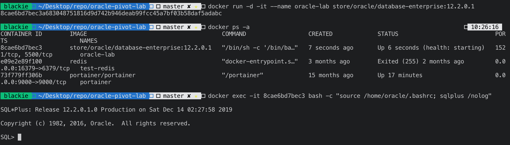
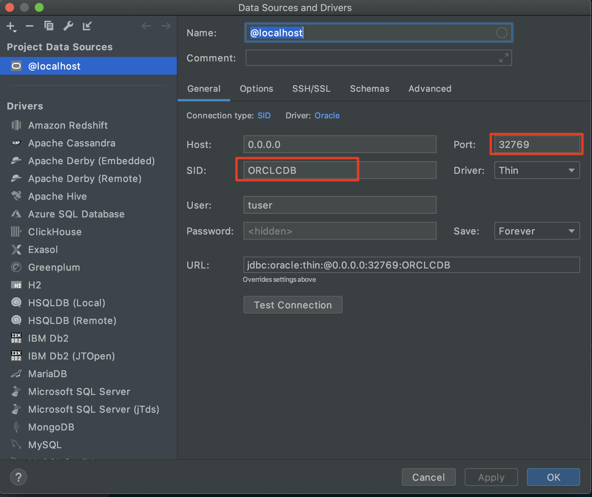
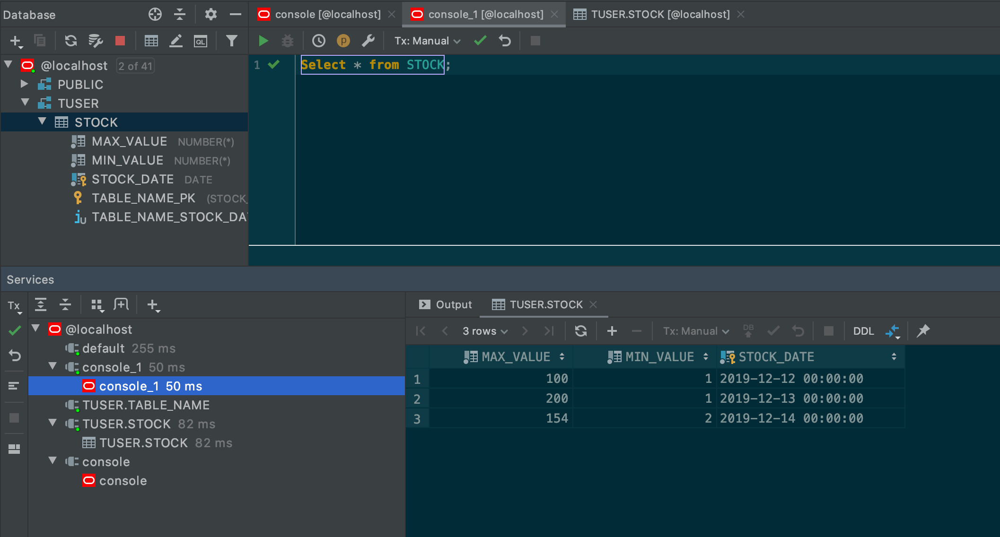

# oracle-pivot-lab

## Setup Oracle from Docker

1. Go to docker hub to confirm the Oracle agreement for pull repository from Enterprise Edition.
2. Back to terminal with command:

        docker login

3. Then pull image with command:

        docker pull store/oracle/database-enterprise:12.2.0.1

4. Running instance with command:

        docker run -d -it --name <Oracle-DB> -P store/oracle/database-enterprise:12.2.0.1

    記得這邊要帶上 `-P` 才會讓 Port 打出去給外面連線 

5. Connecting from within the container:

        docker exec -it <Oracle-DB> bash -c "source /home/oracle/.bashrc; sqlplus /nolog"

## Create Database schema

預設連接帳號為 `sys` 密碼為 `Oradoc_db1`

    docker exec -it <Oracle-DB> bash -c "source /home/oracle/.bashrc; sqlplus /nolog"

以預設帳號連接後，建立測試帳號 tuser 密碼 tuser，並給定足夠的權限。再找出 service names 備用。

    SQL> connect sys as sysdba;
    Enter password:
    Connected.
    SQL> alter session set "_ORACLE_SCRIPT"=true;

    Session altered.

    SQL> create user tuser identified by tuser;

    User created.

    SQL> GRANT CONNECT, RESOURCE, DBA TO tuser;

    Grant succeeded.

    SQL> select value from v$parameter where name='service_names';

    VALUE
    --------------------------------------------------------------------------------
    ORCLCDB.localdomain

    SQL> disconnect;
    Disconnected from Oracle Database 12c Enterprise Edition Release 12.2.0.1.0 - 64bit Production
    SQL>

## 使用 DataGrip 連線

上面幾個地方注意一下就好，就可以放心使用摟

## References

- [在 Docker 中建立 Oracle 12c 的測試主機](https://yingclin.github.io/2018/create-oracle-docker-container.html)